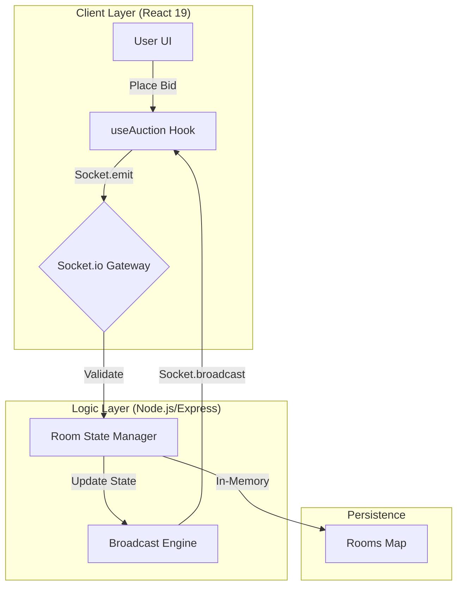
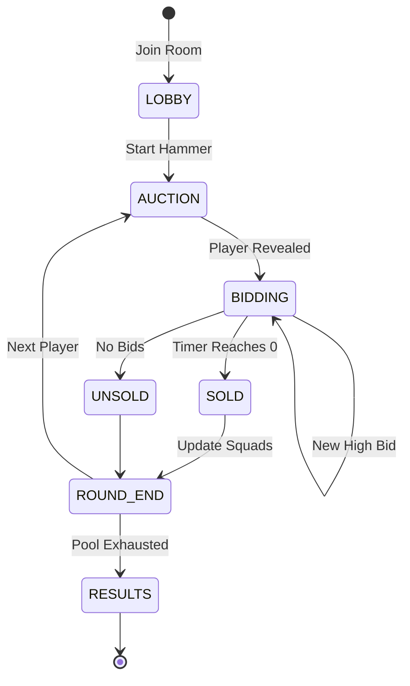

# 🏏 IPL Auction Simulator 2026

[](https://reactjs.org/)
[](https://vitejs.dev/)
[](https://tailwindcss.com/)
[](https://nodejs.org/)
[](https://socket.io/)
[](https://www.typescriptlang.org/)

### **The Ultimate Real-Time IPL Mega Auction Experience**
A high-fidelity, production-grade replica of the professional auction environment. Built for speed, accuracy, and the thrill of the hammer.

---

## 🚀 Problem vs. Solution

| **The Manual Struggle** | **The Digital Blueprint** |
| :--- | :--- |
| **Purse Fatigue:** Manual tracking of ₹120Cr budgets leads to calculation errors. | **Automated Ledger:** Real-time purse deduction and squad validation (25 players, 8 overseas). |
| **Latency Issues:** Discord/WhatsApp auctions suffer from "who bid first" disputes. | **Socket Precision:** Millisecond-accurate bid sequencing via dedicated Socket.io event loops. |
| **Static Data:** Spreadsheets don't capture the adrenaline of a ticking clock. | **Live Pulse:** Dynamic timers, sound triggers, and instant "Sold" status banners. |

---

## 🧠 Intelligence & Architecture

The system is designed using a **Server-Authoritative State** model. The backend maintains the "Single Source of Truth" for every auction room, ensuring all participants see the exact same bid at the exact same millisecond.

### **System Flow Diagram**



### **Auction Lifecycle**



---

## ✨ Key Features

- **⚡ Real-Time Bidding:** Powered by Socket.io for zero-latency competition.
- **🤖 Demo Mode:** No server? No problem. Integrated simulation engine with AI-driven bot bidders.
- **📊 Squad Management:** Comprehensive dashboard for purse tracking, role distribution, and overseas counts.
- **💬 Live Engagement:** Integrated chat system and activity logs to track every move.
- **🎨 Premium UI:** "IPL-Dark" aesthetic with glassmorphism, custom scrollbars, and Lucide iconography.
- **🔊 Immersive Audio:** Dynamic sound triggers for bids, sold players, and final countdowns.

---

## 🛠 Setup & Installation

### **Prerequisites**
- Node.js (v18+)
- npm / yarn

### **1. Clone & Install**
```bash
git clone https://github.com/rahulcvwebsitehosting/ipl-auction-simulator-2026.git
cd ipl-auction-simulator-2026
npm install
```

### **2. Environment Configuration**
The project is pre-configured for local development. The Vite proxy handles the connection between the frontend (Port 3000) and the Socket server (Port 3001).

### **3. Launch the Blueprint**
Open two terminal windows:

**Terminal 1: Backend Server**
```bash
npm run start
```

**Terminal 2: Frontend Dev**
```bash
npm run dev
```

---

## 🏗 Project Structure

```text
├── components/          # Atomic UI Components (Button, PlayerCard, etc.)
├── hooks/               # useAuction.ts - The core state orchestration
├── server.js            # Express + Socket.io backend logic
├── constants.ts         # Official 2026 Player Pool & Team Configs
├── types.ts             # Strict TypeScript definitions
└── App.tsx              # Main Application Entry & Layout
```

---

## 🤝 Connect

Built with 🏏 by **Rahul Shyam**. Let's build the future of sports tech together.

[](https://linkedin.com/in/rahulshyamcivil)
[](https://github.com/rahulcvwebsitehosting)

---
*This project is a technical demonstration of real-time state synchronization and high-performance React architectures.*
